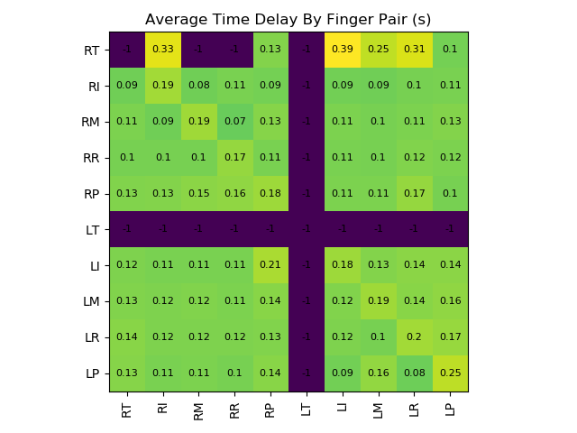
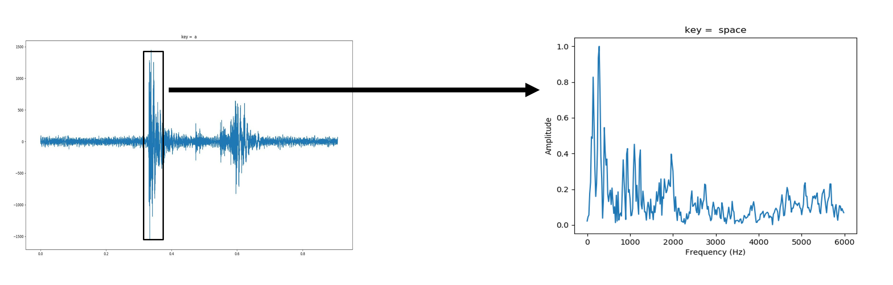
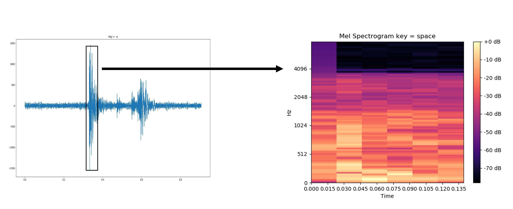
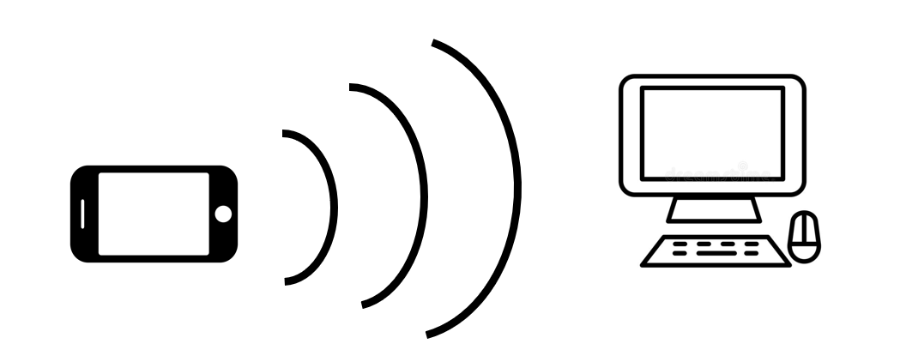

# key-data-analysis

This repository contains an assorted collection of experiments trying to
perform the side-channel attack of determining a user's typed text from just an audio
signal of their typing.

Some approaches tested involve exploiting patterns in time delays between consecutive key presses, others involve 
exploiting the frequency spectrum of the sound of each keystroke, and some involve a combination of the two.

I show decent results for clean, noise-free datasets but haven't been able to show good results for in-the-wild data.

### Time Delays Between Keystrokes

Considering all possible pairs of consecutive key presses, most key pairs have very similar time delays on average.
However, one clear pattern we can observe is that key pairs that use the same finger twice have a slightly larger time delay
on average (except possibly when the key pair is the same *key* twice).

Each cell in the following colormap represents the average time delay in seconds for some finger pair:

### Frequency Spectrum of Sound of KeyStrokes

To find the frequency spectrum of each keystroke's sound, we need to segment each keystroke in the time domain and
convert this region of the signal to the frequency domain. 
1. We can apply a single Discrete Fourier Transform (DFT) on
the audio samples in the time window representing the entire keystroke. 

2. We can apply the DFT on each of several consecutive smaller time windows that cover the entire keystroke. This 
produces a spectrogram. It preserves some time-varying information over the duration of a keystroke.

## Data Collection

All data is collected on QWERTY keyboard layouts for now, but we can likely reproduce the data collection and results
for other layouts too.

### Keyboards
* HP Spectre laptop membrane keyboard
* Dell SK-8115 membrane keyboard

### Audio Recording
* HP Spectre laptop microphone
* 44.1 kHz, mono

## Envisioning Side Channel Attacks

Although the audio was recorded through a laptop microphone for these
experiments, a hypothetical attack would occur through a separate recording device
than the one receiving typed input:
* Recording audio through smartphone of people typing in public spaces, like offices or libraries.

* Smart home devices passively recording audio may identify what you type on your laptop.

 
